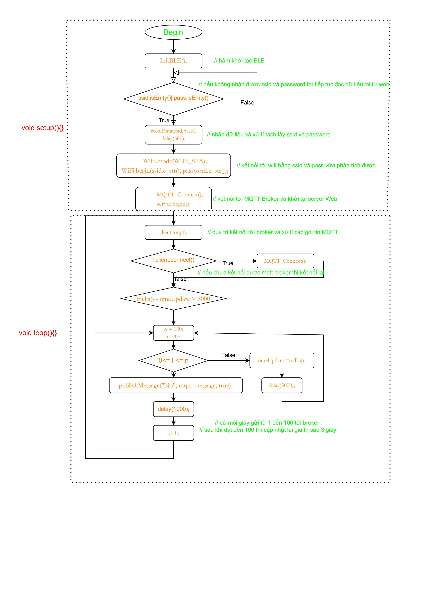

# D23_Nguyen Huu Hoang Anh
# Báo cáo nghiên cứu Lab ngày 01/03/20252025
## A) Công việc đã làm 
### 1) Nhận báo cáo của anh Cảnh về webBLE
- **Link báo cáo**: 
  - <https://github.com/eleptit-club/ELE-D22-NguyenDucCanh/tree/main/ESP/LAB>
### 2) Đọc báo cáo và tìm hiểu về Web BLE và triển khai trên ESP32
- **Nguyên lý hoạt động của code** 
  - Sơ đồ nguyên lý :
    
- **Giải thích code** *code chỉ nhận config Wifi*
```cpp
    #include <WiFi.h>
    #include <WebServer.h>
    #include <BLEDevice.h>
    #include <BLEUtils.h>
    #include <BLEServer.h>
    #include <BLE2902.h> 
    #include <ArduinoJson.h>
    #include <PubSubClient.h>
    // khởi tạo đối tượng websever lắng nghe trên cổng 80 
    // ESP sẽ hoạt động như một máy chủ 
    WebServer server(80);
    String ssid, password; // biến lưu ssid và pass wifi khi nhập từ giao diện web 
    unsigned long timeUpdate = millis();

    // Cấu hình MQTT
    char *mqtt_broker   = "192.168.31.168";   
    char *mqtt_username = "";
    char *mqtt_password = "";
    int   mqtt_port     = 1883;

    //tạo đối tượng WifiClient để kết nối tới wifi và giao tiếp với broker MQTT 
    WiFiClient espClient;
    PubSubClient client(espClient); // tạo đối tượng MQTT client  với espClient để sử dụng các hàm trong thư viện PubSubClientPubSubClient
    String client_id = "esp32-client";
    bool _BLEClientConnected = false; // biến kiểm tra xem đã kết nối được tới WebClient chưa 

    #define BatteryService BLEUUID((uint16_t)0x181F)  // định nghĩa mã UUID cho dịch vụ BLE 

    // định nghĩa mã UUID cho đặc tính dịch vụ 
    BLECharacteristic BatteryLevelCharacteristic(BLEUUID((uint16_t)0x2A18), BLECharacteristic::PROPERTY_READ | BLECharacteristic::PROPERTY_WRITE | BLECharacteristic::PROPERTY_NOTIFY);// với các thuộc tính như đọc , ghi giá trị của đặc tính và cho phép đặc tính gửi thông báo 
    // bộ mô tả (descriptor) cung cấp thông tin mô tả đặc tính để người dùng khác có thể hiểu rõ hơn về đặc tính 
    BLEDescriptor BatteryLevelDescriptor(BLEUUID((uint16_t)0x2901));
    

    // khởi tạo đối tượng MyseverCallbacks kế thừa từ lớp BLESevercallBacks
    // với 2 phương thức onconnect bà onDisconnectonDisconnect
    class MyServerCallbacks : public BLEServerCallbacks {
      // phương thức onConnect sẽ cập nhật giá trị cho biến toàn cục _BLEClientConnected = TRUE khi có web ble kết nối tới ESP 
      void onConnect(BLEServer* pServer) { _BLEClientConnected = true; }
      // phương thức onDisconnnect sẽ cập nhật lại giá trị FALSE khi Web ble ngắt kết nối 
      void onDisconnect(BLEServer* pServer) { _BLEClientConnected = false; }
    };
    //Định nghĩa UUID cho characteristic nhận dữ liệu ( ESP ) 
    #define CHARACTERISTIC_UUID_RX "6E400002-B5A3-F393-E0A9-E50E24DCCA9E"
    //Lớp MyCallbacks kế thừa từ lớp BLECharacteristicCallbacks có sẵn trong thư viện BLE
    class MyCallbacks: public BLECharacteristicCallbacks {
      // thuộc tính onWrite được gọi mỗi khi một client viết dữ liệu lên characteristic mà callback này được gắn vào.
      void onWrite(BLECharacteristic *pCharacteristic) {
      std::string rxValue = std::string(pCharacteristic->getValue().c_str());
        if (rxValue.length() > 0) {
          Serial.print("Received Value: ");
          Serial.println(rxValue.c_str());
        }
      }
    };
    // hàm khởi tại server BLE 
    void InitBLE() {
      BLEDevice::init("BLE_Wifi");// khởi tạo BLE với tên thiết bị là BLE_Wifi
      BLEServer *pServer = BLEDevice::createServer(); // tạo server để các web ble có thể kết nối tới esp
      pServer->setCallbacks(new MyServerCallbacks()); // hàm setcallback để liên tục xứ lí các sự kiện kết nối và ngắt kết nối BLE 
      BLEService *pBattery = pServer->createService(BatteryService);// tạo một dịch vụ BLE với định danh UUID đã được define là 0x181f

      pBattery->addCharacteristic(&BatteryLevelCharacteristic); // tạo đặc tính BLE để đọc ,ghi, nhận thông tin 
      BatteryLevelDescriptor.setValue("Percentage 0 - 100"); // mô tả đặc tính để khi khi người dử dụng đặc tính dịch vụ có thể nắm bắt  
      BatteryLevelCharacteristic.addDescriptor(&BatteryLevelDescriptor);
      BatteryLevelCharacteristic.addDescriptor(new BLE2902()); // cho phép bật thông báo để gửi dữ liệu tự động khi giá trị thay đổi 

      BLECharacteristic *pWriteCharacteristic = pBattery->createCharacteristic(
        CHARACTERISTIC_UUID_RX, BLECharacteristic::PROPERTY_WRITE
      ); // tạo đặc tính nhận dữ liệu từ web BLE với quyền ghi Write 
      pWriteCharacteristic->setCallbacks(new MyCallbacks()); // xử lí dữ liệu khi thiết bị gửi thông tin qua BLE 

      pServer->getAdvertising()->addServiceUUID(BatteryService); // bạt mode quảng bá BLE để các thiết bị SCAN như máy tính , điện thoại có thể quét 
      pBattery->start();
      pServer->getAdvertising()->start();
    }

    void MQTT_Connect() { // hàm kết nối MQTT 
      if (!client.connected()) { 
        client.setServer(mqtt_broker, mqtt_port);
        Serial.print("Connecting to MQTT...");
        if (client.connect(client_id.c_str(), mqtt_username, mqtt_password)) {
          Serial.println("Connected!");
        } else {
          Serial.print("Failed, rc=");
          Serial.println(client.state());// hàm in ra trạng thái lỗi khi kết nối MQTT 
          delay(2000);
        }
      }
    }
    // hàm publish tin nhắn lên broker với topic và message 
    // retained == true : giữ lại tin nhắn trên Broker , false : không giữ tin nhắn, chỉ gửi tin nhắn tại thời điểm publish 
    void publishMessage(const char* topic, String payload, bool retained) {
      if (client.publish(topic, payload.c_str(), retained)) {
        Serial.println("Message published [" + String(topic) + "]: " + payload);
      }
    }

    void setup() {
      Serial.begin(115200);
      InitBLE();
      Serial.println("BLE Initialized");

      // Nhận dữ liệu WiFi từ WebBLE
      while (ssid.isEmpty() || password.isEmpty()) {
        receiData(ssid, password);
        delay(500);
      }

      Serial.println("SSID: " + ssid);
      Serial.println("Password: " + password);

      WiFi.mode(WIFI_STA); // bạt wifi với chế độ như một thết bị khách kết nối với bộ định tuyến 
      WiFi.begin(ssid.c_str(), password.c_str()); // kết nối wifi với thông tin wifi được nhận tùư web ble 

      int timeout = 20;
      while (WiFi.status() != WL_CONNECTED && timeout > 0) {
        Serial.print(".");
        delay(1000);
        timeout--;
      }

      if (WiFi.status() == WL_CONNECTED) {
        Serial.println("\nWiFi Connected!");
        Serial.print("IP Address: ");
        Serial.println(WiFi.localIP()); // in ra địa chỉ IP của esp được bộ định tuyến cấp phát 
      } else {
        Serial.println("\nWiFi Connection Failed!");
      }

      MQTT_Connect(); // kết nối tới MQTT Broker 
      server.begin(); // kích hoạt server , bắt đầu lắng nghe kết nối từ các web ble tới esp và xư xử lí yêu cầu 
    }

    // cập nhật thông tin ssid và password Wifi từ Web Ble thôgn qua dặc tính đã định nghĩa 
    // nhận thôgn tin publish từ web 
    void receiData(String& ssid, String& password) {
      std::string data = std::string(BatteryLevelCharacteristic.getValue().c_str());
      String receivedData = String(data.c_str());

      if (receivedData.startsWith("Wifi:")) { // nếu mở đầu chuỗi nhận là wifi thì xử lí chuỗi và tách lấy ssid và password 
        receivedData.remove(0, 5); // Xóa "Wifi:"
        size_t delimiterPos = receivedData.indexOf(';');
        if (delimiterPos != -1) {
          ssid = receivedData.substring(0, delimiterPos);
          password = receivedData.substring(delimiterPos + 1);
          Serial.println("Received WiFi credentials:");
          Serial.println("SSID: " + ssid);
          Serial.println("Password: " + password);
        }
      } else if (receivedData.startsWith("MQTT:")) { // nếu chuỗi nhận mở đầu bằng MQTT thì xử lý chuỗi và gửi tin nhắn lên mqtt broker 
        receivedData.remove(0, 5); // Xóa "MQTT:"
        size_t delimiterPos = receivedData.indexOf(';');
        if (delimiterPos != -1) {
          String topic = receivedData.substring(0, delimiterPos);
          String message = receivedData.substring(delimiterPos + 1);
          publishMessage(topic.c_str(), message, false);
          Serial.println("MQTT message published:");
          Serial.println("Topic: " + topic);
          Serial.println("Message: " + message);
        }
      }
    }


    void loop() {
      client.loop();
      if (!client.connected()) { // nếu chưa kết nối được với broker thì liên tục kết nối lại
        MQTT_Connect();
      }

      if (millis() - timeUpdate > 3000) { // cứ mỗi 3 giây , esp sẽ gửi 100 tin nhắn đếm từ 1 đến 100 lên broker 
        static int n = 100;
        for (int i = 0; i <= n; i++){
          DynamicJsonDocument doc(1024);
          doc["n"] = i;
          char mqtt_message[128];
          serializeJson(doc, mqtt_message);

          if (client.connected()) {
            publishMessage("No", mqtt_message, true);
            delay(1000);
          }
        }
        timeUpdate = millis();
      }
    }
```
- **lưu ý lỗi *sketch too big***
  khi bị thông báo lỗi *sketch too big* thì cần vào tool --> partition scheme --> đổi sang: Huge App (3MB no OTA / 1MB SPIFFS)
- **Nguyên lý Web_BLEWifi** 
Ngoài việc sử dụng thẻ lệnh HTML để tạo giao diện người dùng, hệ thống còn sử dụng các hàm JavaScript để xử lý và gửi dữ liệu qua giao thức Bluetooth Low Energy (BLE). Dưới đây là các hàm chính giúp thiết bị và trang web giao tiếp với nhau thông qua BLE:
  - **kết nối BLE với esp32**
  ```cpp
    function requestBluetoothDevice() {
    navigator.bluetooth.requestDevice({
      filters: [{ name: deviceName }],
      optionalServices: [bleService]
    })
    .then(device => device.gatt.connect())
    .then(server => server.getPrimaryService(bleService))
    .then(service => service.getCharacteristic(bleCharacteristic))
    .then(characteristic => {
      gattCharacteristic = characteristic;
      gattCharacteristic.startNotifications();
      gattCharacteristic.addEventListener('characteristicvaluechanged', handleChangedValue);
    })
    .catch(error => log("BLE Error: " + error));
  }

  ```
  - **gửi thông tin Wifi qua BLE**
  ```cpp
    function ConnectWifi() {
    var data = new TextEncoder().encode(
      document.getElementById("SSID").value + ";" + document.getElementById("Password").value
    );
    gattCharacteristic.writeValue(data)
      .then(() => log("WiFi credentials sent successfully"))
      .catch(error => log("WiFi send error: " + error));
  }

  ```
  - **nhận dữ liệu từ ESP32 qua ble**
  ```cpp
    function handleChangedValue(event) {
    let dataArray = new Uint8Array(event.target.value.buffer);
    let valueString = String.fromCharCode.apply(null, dataArray);
    log("BLE -> " + valueString);
  }
  ```


- **Thêm chức năng xem và publish từ web lên mqtt thông qua esp**
    - **Gửi tin nhắn lên MQTT broker**
```cpp
    function publishMessage() {
    let topic = document.getElementById("mqttTopic").value;
    let message = document.getElementById("mqttMessage").value;
    mqttClient.publish(topic, message);
    log("MQTT -> " + topic + ": " + message);
  }

```
- cần sửa và thay đổi trong code esp :
  - * hàm onWrite của đặc tính dịch vụ*

    - **onWrite**
  ```cpp
   void onWrite(BLECharacteristic *pCharacteristic) {
      std::string rxValue = std::string(pCharacteristic->getValue().c_str());
        if (rxValue.length() > 0) {
          Serial.print("Received Value: ");
          Serial.println(rxValue.c_str());
        }

      // Phân tách dữ liệu thành SSID, Password, Topic, Message
      String receivedData = String(rxValue.c_str());
      receivedData.trim();
      size_t delimiterPos = receivedData.indexOf(':'); // tìm vị trí của dấu :
      
      if (delimiterPos != -1) {
        String check = receivedData.substring(0, delimiterPos); // nếu có dấu : thì tách tiếp dấu ; để lấy topic và mesage 
        
        if (check == "MQTT") {
          String mqttData = receivedData.substring(delimiterPos + 1);
          size_t delimiterPos2 = mqttData.indexOf(';');
          if (delimiterPos2 != -1) {
            topic = mqttData.substring(0, delimiterPos2);
            message = mqttData.substring(delimiterPos2 + 1);
          } else {
            topic = mqttData;
            message = "";
          }

          // Publish lên MQTT ngay sau khi nhận được dữ liệu
          if (client.connected()) {
            publishMessage(topic.c_str(), message, false);
          } else {
            Serial.println("MQTT not connected, trying to reconnect...");
            MQTT_Connect();
          }
        }
      }
    }
  ```
  - mỗi khi web gửi dữ liệu đến esp thì hàm onWrite sẽ đọc , nếu địng dạng dữ liệu là kiểu MQTT:topic;message thì sẽ được hiểu là dữ liệu publish và esp sẽ tách lấy topic và message để publish lên Broker. 
  - code sau khi sửa lại để có thể publish tin nhắn lên Broker
    - [code](https://github.com/ptitopen-git/D23_NguyenHuuHoangAnh/blob/main/Lab_Report_2024/Report%20of%2020250301/ESP32_BLE_MQTT/ESP32_BLE_MQTT.ino)
  
  
  
### 3) Video demo 
- **link video** 
 [video Demo](https://youtu.be/o9ese3CqDt4)
## B) Công việc tiếp theo
## C) Linh kiện mượn của Lab 
- Không 
